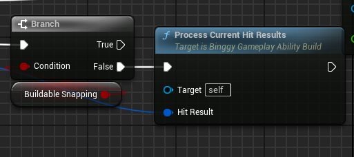

Build
================

Design
------

* Definition: A Definition serves as a blueprint or template outlining the attributes and behaviors of a particular object type.

* Instance: An Instance is a concrete manifestation of a Definition within the game world.

* A World Buildable refers to an object that can be constructed or placed within the game environment by players or game mechanics.

* So Manager component will handle all the instances, while a buildable will have a reference to the instance.
And a instance will have a reference to the buildable, so when the buildable is destroyed, the instance could still be there.

Problem
-------

* When set the tracer data under cursor to execute from a timer, the the client cannot shoot properly. Fixed.

* ``CalculateOffsetSpawnPoint`` Box Extent is wrong

* ``LineTrace`` trace response? Need overlapping result?

* Not always ``bCanEverTick``.

* ``bBuildablePlaced`` connects with status Fixed.

* Two players using the build mode at the same time.

* For world buildable actor. Single-Time Initialization: If the asset is always required immediately upon actor creation, there’s no need for the complexity of soft pointers.

* ``BuildableDef`` soft object ptr not loading. Fixed

* Create a buildable manager component for the player controller.

.. _state-figure:

   This is the caption.

* fix it with state :ref:`state-figure`

Interface
---------

TODO: GetBuildable requirements

Abilities:
----------
``Ability_Build``: it is a per-actor ability that replicates its buildable variable from client to the server.
TODO: Make buildable local spawn and then replicates to the server. Not directly modify the server data which cause
delay for local player.

TODO
----

* Now the build system is based on task ``TargetDataUnderMouse``. Make it use ``WaitForInteractableTarget``.

* Remove shadow when build *Done*

* Set building HUD

* Set correct channel when finish buildable spawning ``EBuildableState::Placed``

* The buildable could be formed by some ``MeshComponent``

* When the placement is invalid, return the actor to original position if there is any. And check for validity of the original position.

* The buildable should implement Interactable interface

* Moving and rotating with an interpolation

* The buildable spin in ``WorldBuildable`` now is using server RPC. Should local predict this.

* Create a manager class to handle build?

Bug:
----
* Only the server is capable of rotate buildable

